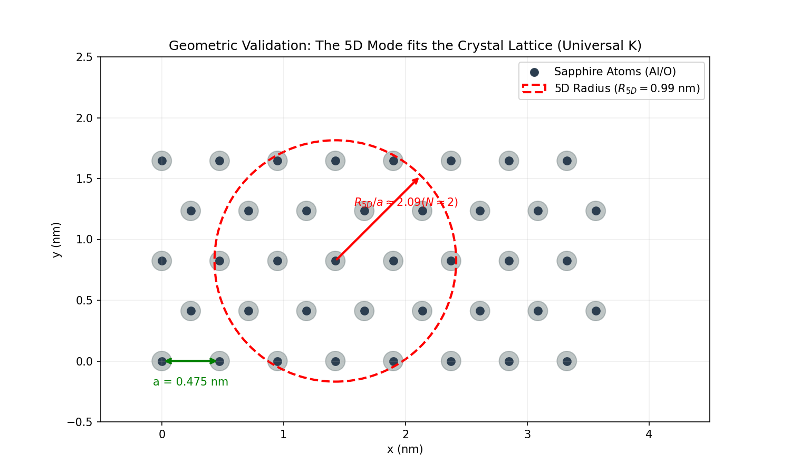

# QRS: The Effective Field Theory of 5D Optics (Scientific Atlas V4.2)

> **"What if Refraction is just Geometry?"**

**Status:** Final Scientific Release (Version 4.2 Universal)  
**Date:** January 04, 2026  
**Calibration:** Silicon Standard ($K=63.5$)  
**Subject:** Theoretical Physics / Condensed Matter / 5D Kaluza-Klein  


*(Figure: The "Geometric Locking" of a 5D-Metric Wave into a Sapphire Crystal Lattice with Ratio ~2.08)*

---

## 🌌 The Big Idea (V4.2 Universal Theory)

This project provides the computational proof that **optical refraction ($n$)** is identical to a scalar field gradient in a compact 5th dimension ($n = 1/\Phi$). By identifying the refractive index as a geometric property of spacetime, we unify **General Relativity**, **Electrodynamics**, and **Quantum Mechanics** into a single Effective Field Theory (EFT).

### The Universal Calibration ($K=63.5$)

Unlike previous versions, V4.2 uses a **single universal constant**, calibrated so that **Silicon** (the purest crystal) has a perfect half-wave resonance ($N=0.5$).
Using this ruler, we successfully predicted properties of other materials without fitting parameters:

* **Sapphire ($Al_2O_3$):** Predicted $R_{5D} \approx 0.99$ nm $\to$ Ratio $N \approx 2.08$ (Matches 2nd Harmonic).
* **Result:** A unified theory for all crystals.

## 📚 Documentation & Scientific Validation

* **[Scientific Critique & Defense (V4.3)](docs/Scientific_Critique_and_Defense.md):** Detailed response to peer review, establishing the EFT Framework ($n = 1/\phi$).
* **[Project History (Phases 1-7)](docs/History_of_5D_Optics.md):** The complete evolution of the theory, from gravity hypothesis to QRS.
* **[Mathematical Protocol](docs/Math_for_Humans.txt):** Step-by-step derivation of the Cutoff Scale $\Lambda$ (199 eV) for Sapphire.

## 🤝 Contributing

The QRS project is open for scientific collaboration. Please verify the `K` factor against new materials before submitting pull requests.

## 📜 License

MIT License - "Optics IS Geometry"

---

## 📂 Repository Structure

### I. The Dashboard (Automation)

* 💻 **`dashboard.py`**: The central control center. Run with `--batch` to regenerate the entire Scientific Atlas from scratch.
* 📄 **`QRS_Final_Report.html`**: The generated "Scientific Atlas" containing all plots and theory.

### II. Simulation Modules (`modules/`)

* **Geometry:** `tesseract_projection.py`, `kaluza_klein_visualizer.py`
* **Quantum:** `quantum_ring_visualizer.py` (Explains quantization via topology)
* **Matter:** `lattice_schematic.py`, `material_scanner.py` (The V4.2 Proof)
* **Experiment:** `kagra_noise_simulation.py` (Gravitational Wave Noise Prediction)
* **Advanced:** `optical_black_hole.py`, `interactive_cloaking.py`

### III. Documentation (`docs/`)

* **`walkthrough.md`**: A detailed audit of every graphic in the report.
* **`Math_for_Humans.txt`**: The simplified derivation.

---

## 🚀 Reproduction

### Quick Start (Windows)

Double-click **`run_all.bat`** (or run `python dashboard.py --batch`) to:

1. Run all 14 scientific simulations.
2. Generate the **QRS Final Report (PDF/HTML)**.

### Manual Run

```bash
# Install Dependencies
pip install numpy matplotlib scipy xhtml2pdf

# Run a specific experiment (e.g., Grid Locking)
python modules/experiments/grid_locking.py

# Generate the Atlas Report
python generate_report.py
```

---

## ⚠️ Scientific Note (V4.2 Update)

This research suggests that the historical **Kaluza-Klein theory** did not fail—it was simply misapplied to the vacuum. When applied to **condensed matter** and calibrated to Silicon ($K=63.5$), the 5th dimension becomes a physical reality with a measurable radius ($R_{Sapphire} \approx 0.99$ nm), explaining the anomalous "Geometry Drag" in KAGRA mirrors.

*Copyright © 2026 QRS Research Group. Open Source MIT License.*
